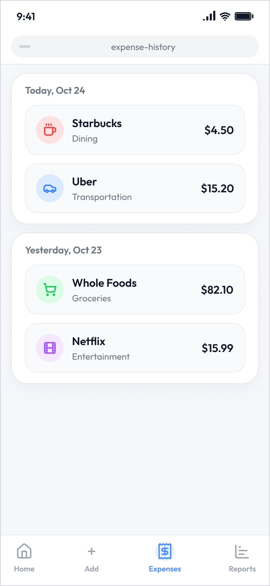
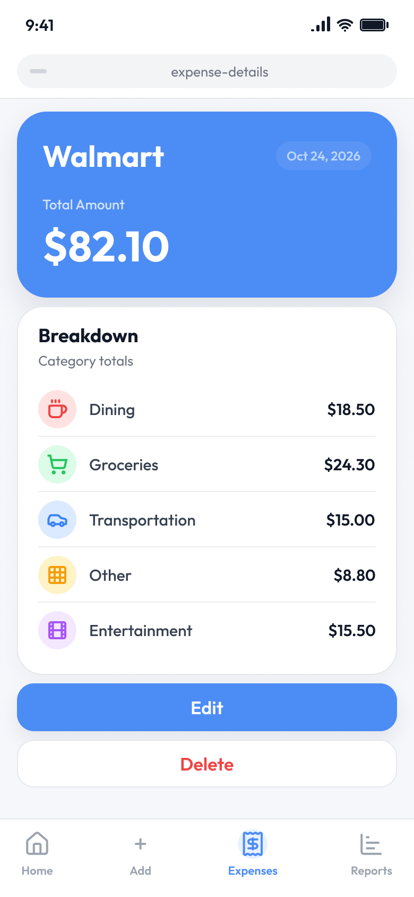
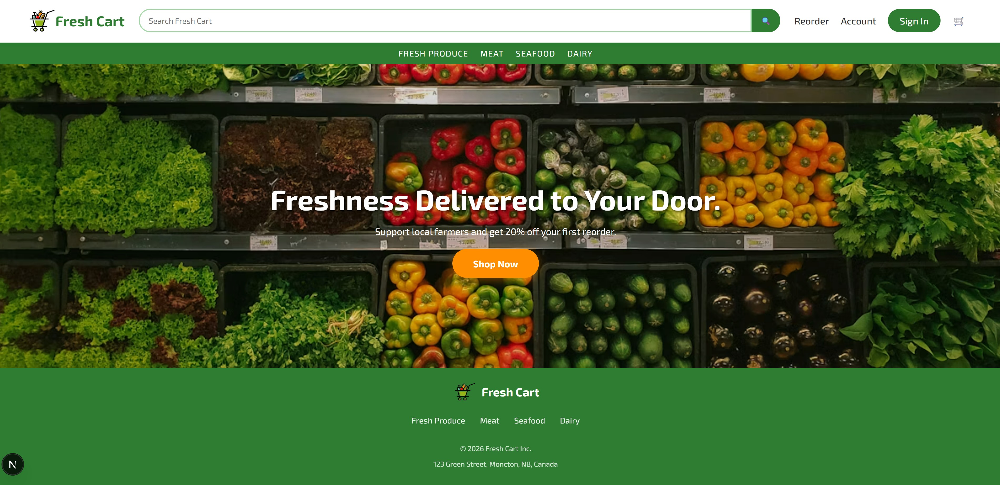
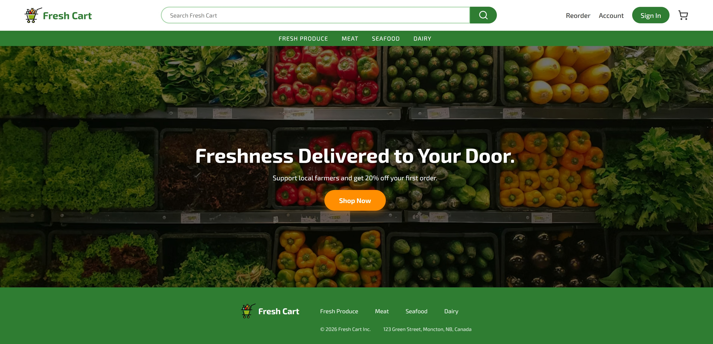

# UI/UX Design Portfolio

This repository showcases my UI/UX design projects, including original UI designs and redesign explorations.

As a full-stack developer, I am interested in creating intuitive, user-friendly, and visually consistent interfaces. Through these projects, I explore UI/UX design principles, improve existing interfaces, and strengthen my ability to translate designs into functional web applications.

## 🗂️ Projects

This portfolio includes:

- UI Design: Original interface designs focusing on information architecture, visual hierarchy, layout, typography, and color.

- UI/UX Redesign: Explorations of existing interfaces and user flows to identify usability issues and propose improvements.

### 01. Receipt Expense Tracker UI

A mobile UI design concept for an expense tracking application, focusing on clear expense information, visual hierarchy, and intuitive navigation.

  
   &nbsp;&nbsp;&nbsp;
  

---

### 02. Fresh Cart Homepage redesign

- Redesigned the hero section to improve visual hierarchy.
- Reorganized the header and the footer to improve spacing and alignment.
- Standardized icons using Lucide to improve visual consistency.

### Before

### After

### Live Demo

[Fresh Cart](https://fresh-cart-v2-eta.vercel.app/)

## 🎨 Tools

- Figma
